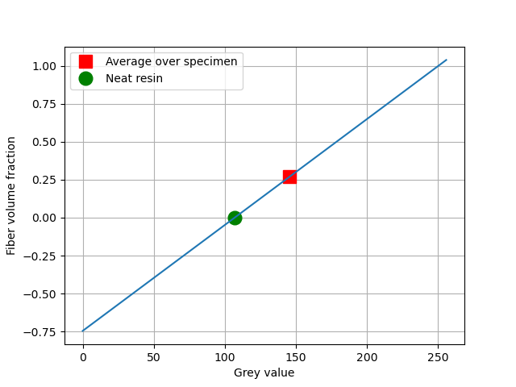

[](https://github.com/psf/black)
[](https://raw.github.com/nilsmeyerkit/fiberoripy/master/LICENSE)
[](https://zenodo.org/badge/latestdoi/333071299)

# fiberspot: Local Fiber Volume fraction

Identify local [fiber volume content][url_fiber_volume_content] of flat thin fiber reinforced composites
based on 2D optical images.
The algorithm described here is very simple and has been developed in cooperation with Juliane Lang within the [DFG][dfg_website]-project [IRTG2078][grk_website].
Applicability is not proven and potential problems are discussed below.

See [license](https://github.com/JulianKarlBauer/fiberspot/blob/main/LICENSE),
[acknowledgment](#acknowledgment)
and please
[cite as](https://zenodo.org/record/4471261/export/hx#.YBFCgtYo-Ts)

```bibtex
@software{juliankarlbauer_2021_4471261,
  author       = {JulianKarlBauer},
  title        = {JulianKarlBauer/fiberspot: Prototype},
  month        = jan,
  year         = 2021,
  publisher    = {Zenodo},
  version      = {v0.0.1},
  doi          = {10.5281/zenodo.4471261},
  url          = {https://doi.org/10.5281/zenodo.4471261}
}
```

**Call for application**:
If you have data sets you would like to analyze, please contact me or
think about opening an issue.


### Motivation

Local fiber volume fraction is the fiber orientation information of zeroth order.
Spatial variance of fiber volume fraction is an inherent property of inhomogeneous
materials.
Accurate determination of local mechanical properties by e.g. homogenization schemes
requires knowledge on the local fiber volume fraction.

Local fiber volume fraction can be determined by analyzing reflection and
distraction of radiation as e.g. x-rays.

Optical measurements, i.e. images taken with conventional cameras, are

- Availabile
- Cheap
- Flexible
- And offer high resolution.

If a flat, shell-like specimen is illuminated from one side and the transmitted
light intensity is measured by on optical sensor (camera) from the other side, we call
the resulting image an radiography image.

This package maps light intensity of radiography images to local fiber volume fraction.
The key idea can be used for any heterogeneous materials consisting of phases with
differing transparency or noticeable reflection at the interfaces of the phases.
An example are some glass fiber reinforced thermosets.

### Challenges on Practical Application

- Homogeneous lightning conditions
- Homogeneous specimen thickness
- Exploitation of complete range of light intensity of camera
- Identification of lower bound for neat resin (watch specimen thickness)
- Identification of local coordinate system

### Solved Challenges:

- Masking features inside an image by image segmentation
- Weighted / normalized convolution filtering

### Algorithm

- Identify linear mapping between local fiber volume fraction and light intensity
  from the following two measurements:
  	1. Light intensity in specific region with fiber volume fraction equals zero, i.e. without fibers
  	2. Average light intensity of specimen correlating with average volume fiber fraction of the specimen

Inverted light intensity, i.e. darkness:

```
     | --------------|----------------|---------------- |
 lower bound    neat resin     specimen mean       upper bound

```



## Installation

- Clone the git-project to your machine
	```shell
	git clone
	```
- Install the package from local repository into current environment in develop mode:
	```shell
	python setup.py develop
	```

Note: [Develop vs. install](https://stackoverflow.com/a/19048754/8935243)

## Usage

See the [example script](fiberspot/example_script.py)
which identifies a field of the local fiber volume fraction
using various filter algorithms:

Original Image


Application of the skimage mean filter with disk area and a radius of 60pixel
combined with normalized convolution filtering masking the hair cross yields


## Acknowledgment

The research documented in this repository has been funded by the 
[German Research Foundation (DFG, Deutsche Forschungsgemeinschaft)][dfg_website] - project number [255730231][dfg_project].
The support by the German Research Foundation within the International Research Training Group 
[“Integrated engineering of continuous-discontinuous long fiber reinforced polymer structures“ (GRK 2078)][grk_website]
is gratefully acknowledged.

Supply of the example image by Juliane Lang is gratefully acknowledged.

[grk_website]: https://www.grk2078.kit.edu/
[dfg_website]: https://www.dfg.de/
[dfg_project]: https://gepris.dfg.de/gepris/projekt/255730231

[url_fiber_volume_content]: https://en.wikipedia.org/wiki/Fiber_volume_ratio

